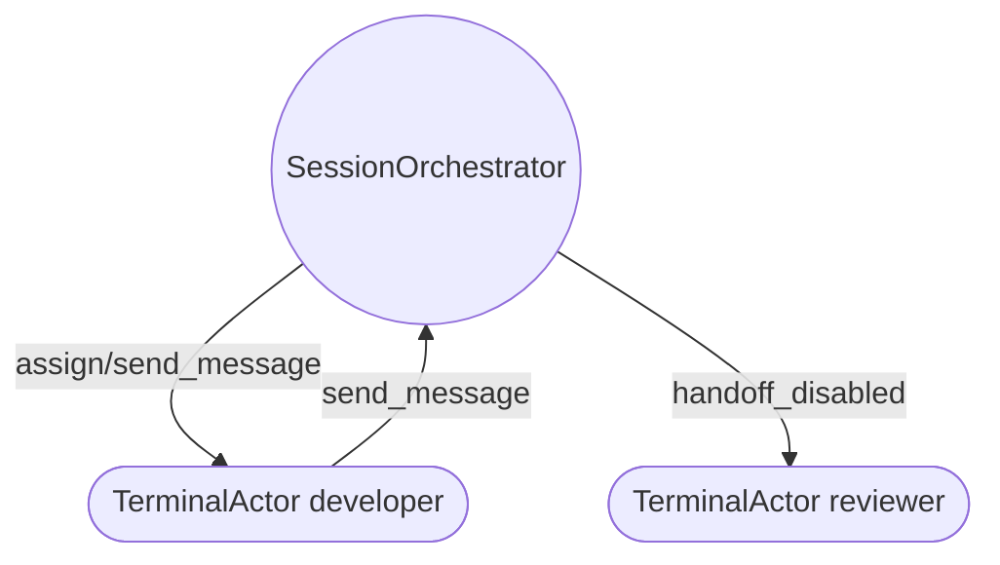
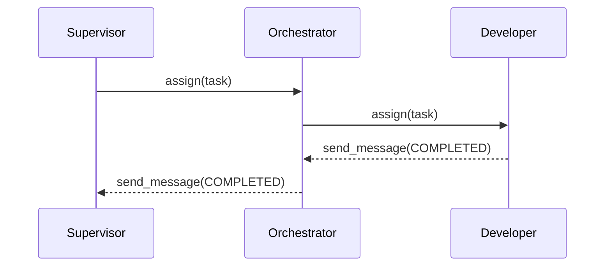

# Java Agent Orchestrator

A complete rewrite of the CLI Agent Orchestrator using Java 21, Spring Boot 3, Apache Pekko actors, and a modern React dashboard.

## Overview

- **Backend** (`/java/`): Reactive Spring Boot service exposing REST + WebSocket APIs, orchestrating Apache Pekko actors, and persisting terminal state in PostgreSQL via R2DBC (with in-memory H2 defaults).
- **Frontend** (`/javaUI/`): React 18 + TypeScript + Tailwind application that renders real-time terminal activity, topology diagrams (Mermaid), and progress tracking over a WebSocket feed.
- **CLI** (`jao` / `cao`): Picocli-powered command line compatible with the original verbs (`server`, `launch`, `flow`, `shutdown`).





## Getting Started

### Prerequisites

- Java 21+
- Maven 3.9+
- Node.js 20+ (for the UI)
- Docker (for Testcontainers-based integration tests)

### Backend

```bash
# Run tests (unit + Testcontainers integration)
mvn -f java/pom.xml verify

# Run the orchestrator server
./jao server --port 8080
```

### CLI

```bash
# Launch a terminal actor via REST
./jao launch --alias developer --role engineer --handles owner(task-42)

# List and add flows
./jao flow list
./jao flow add --name onboarding --spec "assign developer -> send_message"

# Gracefully shutdown
./jao shutdown
```

The legacy `cao` command remains as a compatibility alias.

### Frontend

```bash
cd javaUI
npm install
npm run dev
```

The dashboard connects to the backend at `http://localhost:8080` and renders real-time events pushed over `/ws/terminal-events`.

## Testing

Integration tests use Testcontainers to start PostgreSQL and validate actor registration, message routing, and persistence. Run them with:

```bash
mvn -f java/pom.xml verify
```

## Structured Logging

Console logs are emitted as JSON. Configure `SPRING_R2DBC_URL` to point to a PostgreSQL instance for persistent storage. By default, the application uses in-memory H2 with Postgres compatibility.

## License

Apache 2.0
