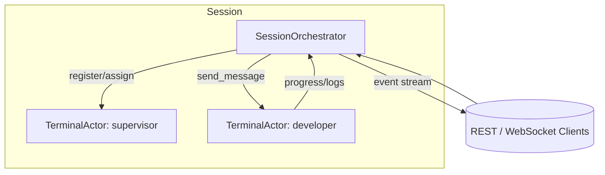
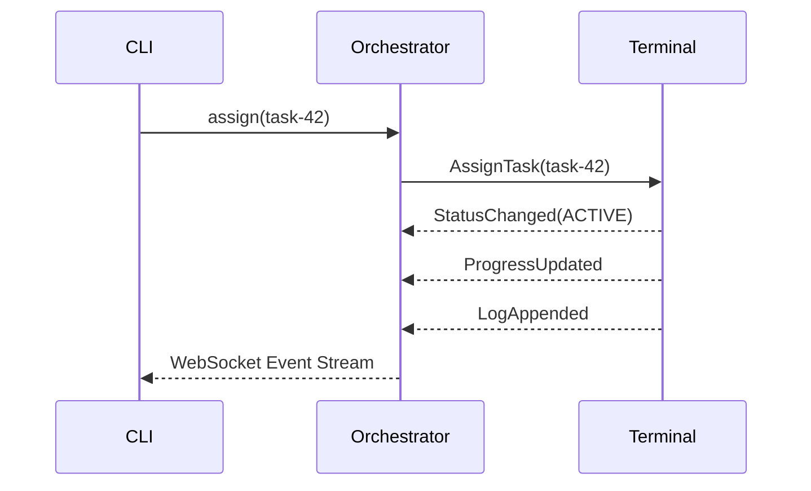

# Java Agent Orchestrator (JAO)

JAO is a full rewrite of the original CLI agent orchestrator into a modern Java 21 and Spring Boot 3 platform. The backend exposes a reactive API, Testcontainers-backed persistence, and an actor-oriented runtime built on Apache Pekko. A React + Tailwind dashboard and a Picocli-powered CLI provide real-time visibility and control over sessions, terminals, and flows.

## Architecture Overview

- **Actor system** – Every terminal runs as an isolated `TerminalActor` that persists its state, streams structured logs, and tracks progress. A `SessionOrchestrator` actor supervises registration, handle resolution, and message routing across UUIDs, aliases, and dynamic task handles such as `owner(task-42)`.
- **Reactive backend** – Spring Boot WebFlux serves REST endpoints for orchestration commands and a WebSocket stream (`/ws/events`) that mirrors actor events as JSON.
- **Persistence** – Terminal metadata, logs, and flow definitions are stored in PostgreSQL via Spring Data R2DBC. Schema bootstrapping is handled through `schema.sql`.
- **CLI** – The `jao` command mirrors the legacy verbs (`server`, `launch`, `flow add/list/run`, `shutdown`) and retains a compatibility entry point under `cao`.
- **UI** – The `/javaUI` React application renders the current actor topology with D3 and surfaces live logs and task progress over WebSocket.

### Communication Diagram



### Session Lifecycle



## Repository Layout

```
/java/     # Spring Boot + Pekko backend
  ├── actor/        # Terminal and orchestrator behaviors
  ├── api/          # REST controllers & WebSocket handlers
  ├── cli/          # Picocli entry points (jao & cao)
  ├── config/       # Actor system and WebSocket configuration
  ├── domain/       # Immutable records and enums
  ├── events/       # Event publishing to the UI
  ├── persistence/  # R2DBC entities and repositories
  ├── service/      # Orchestration and flow services
  └── test/         # JUnit + Testcontainers integration tests
/javaUI/  # React 18 + Tailwind dashboard
```

## Getting Started

### Prerequisites

- Java 21
- Maven 3.9+
- Node.js 20+ (for the UI)
- Docker (for Testcontainers-enabled tests)

### Build & Test

```bash
# Compile and run backend tests
mvn -f java/pom.xml clean verify

# Install UI dependencies and run lint-free type checks via Vite build
npm --prefix javaUI install
npm --prefix javaUI run build
```

The Maven build runs Testcontainers-backed integration tests that validate terminal registration, alias and handle routing, and flow scheduling against PostgreSQL.

### Running the Orchestrator

```bash
# Start the reactive backend
mvn -f java/pom.xml spring-boot:run

# Launch the dashboard (runs on http://localhost:5173 with API proxying)
npm --prefix javaUI run dev
```

### CLI Usage

```bash
# Start the server from the CLI
java -jar java/target/jao-1.0.0-SNAPSHOT.jar server

# Register a terminal
java -jar java/target/jao-1.0.0-SNAPSHOT.jar launch --alias developer --role builder

# Manage flows
java -jar java/target/jao-1.0.0-SNAPSHOT.jar flow add --name demo --task "Task A" --task "Task B"
java -jar java/target/jao-1.0.0-SNAPSHOT.jar flow run --flow-id <uuid> --target developer

# Graceful shutdown
java -jar java/target/jao-1.0.0-SNAPSHOT.jar shutdown

# Legacy alias retained
java -jar java/target/jao-1.0.0-SNAPSHOT.jar launch ...
java -jar java/target/jao-1.0.0-SNAPSHOT.jar CaoCommand # delegates to jao
```

> The CLI communicates with the running backend via REST/WebFlux endpoints and enables orchestration automation from scripts or CI pipelines.

### Dashboard Features

- Actor graph rendered with D3 force simulation
- Live terminal cards showing status, recent logs, and task progress
- WebSocket-driven updates sourced from the Pekko actor event stream

## Logging & Observability

Structured JSON logging is enabled for the backend via Logback configuration (`application.yml`). The WebSocket event feed mirrors terminal status changes, log entries, and task progress for external monitoring systems.

## Contributing

See [`CONTRIBUTING.md`](CONTRIBUTING.md) and [`CODE_OF_CONDUCT.md`](CODE_OF_CONDUCT.md) for guidelines. The repository now defaults to Java/Spring conventions—pull requests should include passing Maven builds, Vite builds for the UI, and updated diagrams or documentation when the actor topology changes.
